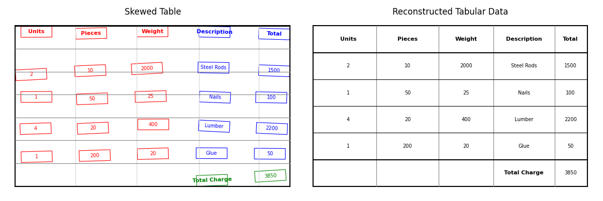

<<<<<<< HEAD
# 📊 Table Extraction & Reconstruction

Robust document AI engineering for noisy, skewed, and distorted tables.

This project demonstrates a custom pipeline for reconstructing structured tabular data from raw OCR XY outputs — even when documents are low-quality, photographed at odd angles, or partially warped.

Instead of relying solely on off-the-shelf OCR (e.g., Tesseract/Textract), the method applies **geometric reasoning, slope-by-quadrant correction, and dynamic heuristics** to recover clean, structured tables suitable for downstream analytics.

Originally designed for freight invoices and logistics documents, it generalizes to any domain where reliable tabular reconstruction from imperfect OCR is required.

---

## ✨ Features

- **Quadrant-Based Slope Detection & Correction**  
  Detects skew per quadrant and applies average slope correction to straighten bounding boxes — even for documents draped or warped (e.g., documents photographed over a truck driver’s knee).

- **Dynamic Header Detection**  
  Builds dictionaries of expected headers (Quantity, Pieces, Weight, Description, Total).
  Chooses the best candidates based on vertical alignment across the page.

- **Column Bounding**  
  Determines column boundaries dynamically using header width and horizontal spacing.
  Adapts to irregular or inconsistent document layouts.

- **Table Termination Logic**  
  Iterates rows until reaching logical endpoints (e.g., “Total Charge”), avoiding bleed-through into other page content.

- **Robust to Real-World Noise**  
  Handles low-quality OCR, skew, distortion, and poor contrast while still recovering structured, analysis-ready data.

- **Visualization Tools**  
  Compare raw skewed bounding boxes vs. reconstructed Excel-like tables with side-by-side plots.

---

## 📦 Installation

Clone the repository and install dependencies:

```bash
git clone https://github.com/jac-wil/table_extraction.git
cd table_extraction
pip install -r requirements.txt
```
---

## ▶️ Run the Demo
Launch the included Jupyter notebook:

```bash
jupyter notebook demo.ipynb
```

This will:
- Generate synthetic OCR data (sample_data/ocr_output.json)
- Detect headers, rows, and totals automatically
- Correct skew using quadrant-based slope averaging
- Reconstruct aligned, structured tabular data
- Render **before vs. after** correction

---

## 📷 Example Output


---

## 📂 Repo Structure
```/table_extraction
  ├── table_utilities.py        # OCRBox class, slope correction
  ├── table_reconstruction.py   # Grid alignment & visualization
  ├── generate_synthetic.py     # Synthetic OCR generator
  ├── demo.ipynb                # End-to-end demo notebook
  ├── sample_data/
  │     ├── ocr_output.json
  │     ├── table_extraction_before_after.png
  ├── requirements.txt
  └── README.md
```
---

## 🛠 Tech Stack
- Python 3.8+
- Matplotlib for visualization
- NumPy / Pandas for data manipulation
- Custom OCR slope-correction & row clustering logic

---

## 📌 Notes
- Synthetic OCR generation is included so you can run the demo without external data.
- You can plug in your own OCR JSON output in place of sample_data/ocr_output.json.

---

## 📜 License
MIT License © 2025 Jacob Wilson
=======
# table_extraction
>>>>>>> 06a0c7fb43155810f2a33e57cf3dc104a9e2942e
